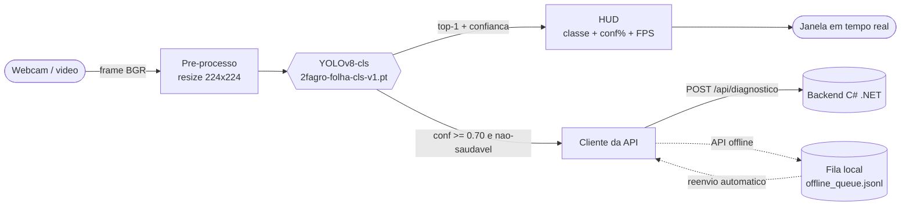

# 📷 2F-AGRO · Olho na Folha

> **Visão computacional** do projeto **2F-AGRO** — um script Python (YOLOv8 + OpenCV)
> que detecta **pragas e doenças em folhas via webcam, em tempo real**.
> Matéria: **IoT / Physical Computing** (100 pts) · FIAP 3ES · GS 2026.1

[](https://github.com/GS-SPACE-CONNECT/2f-agro)
[](https://www.python.org)
[](https://docs.ultralytics.com)
[](https://opencv.org)

---

## 🎯 Objetivo

### Negócio

O pequeno agricultor familiar aponta a câmera pra uma folha suspeita e recebe,
em tempo real, o diagnóstico da praga ou doença — sem internet rápida, sem
laboratório, sem assistência técnica presencial. Isso permite **intervenção
precoce**, reduzindo perdas na lavoura e custos com insumos aplicados no escuro.
É a "camada de bolso" do 2F-AGRO: a parte que vive na mão do produtor e conecta
com o app mobile e a API de alertas.

### Técnico

Implementar um **pipeline de classificação de imagens em tempo real** com
YOLOv8-cls (Ultralytics) + OpenCV, capaz de:

- capturar frames de webcam, vídeo ou pasta de imagens;
- classificar entre **6 classes** (5 pragas + saudável) treinadas sobre o dataset
  PlantVillage;
- exibir **HUD** com classe, confiança e FPS sobre o frame;
- reportar diagnósticos para a API do backend C# .NET, com **fila offline** para
  resiliência quando a rede estiver indisponível.

A escolha por **classificação** (não detecção por caixas) é proposital: o
PlantVillage é um dataset de classificação (uma folha por imagem), então `cls` é
o casamento natural — treina rápido, fica robusto e é eficiente em CPU.

## 📦 Entregáveis (100 pts)

- **Vídeo da solução** (50 pts) — demo + arquitetura + FPS visível
- **Script Python** (30 pts) — modularizado + tratamento de exceções **obrigatório**
- **Repositório Git** (20 pts) — este repo + `requirements.txt` + README + diagrama

## 🌿 Classes detectadas (6)

| Classe (rótulo na tela) | Praga/doença | Origem (PlantVillage) |
| --- | --- | --- |
| `Mancha bacteriana (tomate)` | Xanthomonas | `Tomato___Bacterial_spot` |
| `Requeima / mildio (tomate)` | *Phytophthora infestans* | `Tomato___Late_blight` |
| `Oidio / mofo branco` | Powdery mildew | `Squash___Powdery_mildew` |
| `Podridao negra (uva)` | *Guignardia bidwellii* | `Grape___Black_rot` |
| `Ferrugem (milho)` | *Puccinia sorghi* | `Corn___Common_rust` |
| `Folha saudavel` | — (sem alerta) | `Tomato___healthy` |

> **Nota honesta de escopo:** o PlantVillage não tem **café**, então "ferrugem do café"
> (sugerida no briefing) foi substituída por **ferrugem do milho** — mesma natureza
> (fungo *Puccinia*), e presente no dataset. "Lagarta-do-cartucho" é inseto (não doença
> de folha) e ficou fora. As 6 classes cobrem o mínimo de 3 da rubrica com folga.

## 🧠 Pipeline de Visão Computacional



1. **Captura** — `src/camera.py` abre webcam/vídeo/pasta com reconexão resiliente.
2. **Classificação** — `src/classifier.py` roda o YOLOv8-cls e devolve `(classe, confiança)`.
3. **HUD** — `src/overlay.py` desenha classe, barra de confiança e **FPS** sobre o frame.
4. **Alerta** — acima do limite e não-saudável, `src/api_client.py` envia o diagnóstico
   pra API; se ela estiver fora, grava numa **fila offline** e reenvia depois.

## 🗂️ Estrutura

```
2f-agro-iot/
├── olho_na_folha.py        # ▶ entrypoint (loop de vídeo em tempo real)
├── src/
│   ├── config.py           # threshold, endpoint, mapa de classes PT-BR
│   ├── classifier.py       # wrapper YOLOv8-cls
│   ├── camera.py           # fonte de frames (webcam/vídeo/imagens)
│   ├── overlay.py          # HUD: classe + confiança + FPS
│   └── api_client.py       # POST /diagnostico + fila offline
├── train/
│   ├── prepare_dataset.py  # PlantVillage -> 6 classes -> split 80/20
│   ├── train.py            # fine-tuning YOLOv8-cls
│   └── colab_treino.ipynb  # treino com GPU gratis (Colab)
├── tools/mock_api.py       # mock local da API pra testes
├── tests/smoke_test.py     # testes headless (sem webcam)
├── models/                 # modelo treinado (.pt) versionado
├── requirements.txt        # dependencias com versoes fixas
└── README.md
```

## 🚀 Como rodar

### 1. Ambiente

```bash
python -m venv .venv
source .venv/bin/activate          # Windows: .venv\Scripts\activate
pip install -r requirements.txt
```

### 2. Demo ao vivo (webcam)

```bash
python olho_na_folha.py            # webcam padrao (indice 0)
```

Aponte uma folha pra câmera. A tela mostra a classe, a confiança e o **FPS**.
Tecla **`q`** encerra.

### 3. Sem webcam? Testa com imagens ou vídeo

```bash
python olho_na_folha.py --source assets/samples/   # pasta de imagens
python olho_na_folha.py --source demo.mp4          # arquivo de video
python olho_na_folha.py --headless --save out/     # sem janela, salva frames
```

### 4. Integração com a API (opcional)

```bash
python tools/mock_api.py 5000      # terminal 1: sobe um mock da API
python olho_na_folha.py --api-url http://localhost:5000/api/diagnostico   # terminal 2
```

Payload enviado: `{ "praga", "confianca", "timestamp", "geo" }`.
Use `--no-api` pra desligar o envio.

## 🏋️ Treinar o modelo

O modelo já vem treinado em `models/2fagro-folha-cls-v1.pt`. Pra retreinar:

**Local (CPU/GPU):**
```bash
python train/prepare_dataset.py --src <pasta_PlantVillage>/raw/color
python train/train.py --epochs 20           # use --device 0 se tiver GPU
```

**Google Colab (GPU grátis):** abra `train/colab_treino.ipynb`, selecione GPU e rode
todas as células — ele baixa o dataset, treina e baixa o `.pt` final.

Dataset: [PlantVillage](https://github.com/spMohanty/PlantVillage-Dataset) (color).

## ✅ Robustez (rubrica)

| Exigência | Onde |
| --- | --- |
| **Tratamento de exceções** no stream | `try/except` por frame + `try/finally` que libera a câmera (`olho_na_folha.py`) |
| **FPS visível** na tela | `src/overlay.py` (canto superior direito) |
| Robustez a iluminação/oclusão | classificação YOLOv8 + augmentation no treino |
| Webcam cai no meio | reconexão automática (`src/camera.py`) |
| API fora do ar | fila offline + reenvio (`src/api_client.py`) |
| `requirements.txt` com versões fixas | ✔ |

## 🧩 Stack

Python 3.9+ · Ultralytics **YOLOv8-cls** · OpenCV · PyTorch · NumPy · Requests

## 👥 Integrantes do Grupo — IoT / Physical Computing (GS 2026.1)

| Nome | RM | GitHub |
| --- | --- | --- |
| João Victor Franco | 556790 | [@jota0802](https://github.com/jota0802) |
| Bruno Leão | 555563 | [@brnleao](https://github.com/brnleao) |
| Ruan Melo | 557599 | [@DevRuanVieira](https://github.com/DevRuanVieira) |
| Rodrigo Jimenez | 558148 | [@roji-menez](https://github.com/roji-menez) |
| Lucca Borges | 554608 | [@lucksza](https://github.com/lucksza) |

FIAP · 3ES · Global Solution 2026.1 · Disciplina **IoT / Physical Computing**

## 🔗 Links

- [Hub do projeto 2F-AGRO](https://github.com/GS-SPACE-CONNECT/2f-agro)
- [Spec § 4.2 IoT/CV](https://github.com/GS-SPACE-CONNECT/2f-agro/blob/main/docs/specs/2026-05-27-2f-agro-design.md)
- [App Mobile (integração)](https://github.com/GS-SPACE-CONNECT/2f-agro-mobile)
